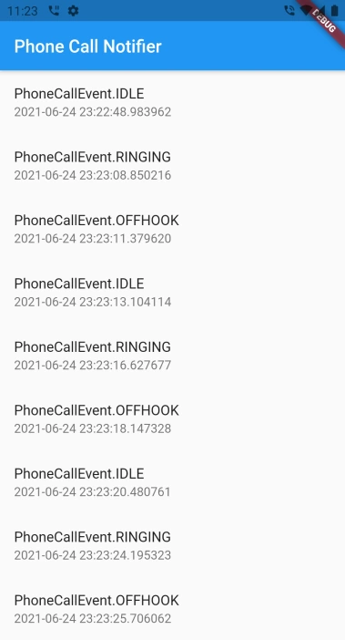

# phone_call_notifier

Triggers a callback when the phone receives a phone call

Currently Android Only

### Example

```dart
PhoneCallNotifier().listen.forEach((event) {
      // use event...
});
```

The Example App:

